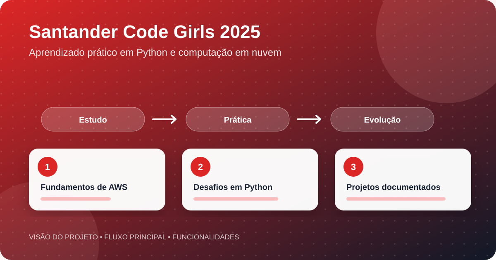

<div align="center">


</div>




<div align="center">

[](#)
[](https://www.dio.me/)
[](#)
[](#)

**Registro de estudos, desafios de código e projetos desenvolvidos no Santander Code Girls 2025.**

</div>

## Sobre o repositório

Este espaço organiza atividades realizadas no bootcamp oferecido pelo Santander Open Academy em parceria com a DIO. O conteúdo acompanha a evolução prática em programação, computação em nuvem e resolução de problemas.

## Trilhas documentadas

| Módulo | Conteúdo |
|---|---|
| Conceitos de recursos | Exercícios com EC2, S3 e Lambda |
| Armazenamento e CDN | S3, Glacier, CloudFront, ciclo de vida, replicação e cache |
| Desafios de código | Soluções em Python e documentação do raciocínio |

## Estrutura

```text
Desafios_de_codigo_1_conceitos_de_recursos/
Desafios_de_codigo_2_servicos_de_armazenamento_e_cdn/
README.md
```

Cada diretório reúne sua própria documentação e os arquivos Python relacionados ao tema.

## Objetivos de aprendizagem

- Consolidar fundamentos de cloud computing
- Compreender serviços essenciais da AWS
- Praticar lógica e automação com Python
- Organizar projetos e aprendizados no GitHub
- Desenvolver documentação técnica clara

## Autoria

Desenvolvido por **[Geovanna Eduarda da Silva](https://github.com/geovannasilva15)**.
